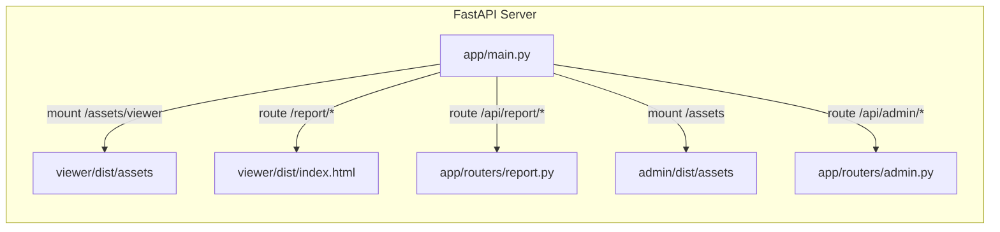
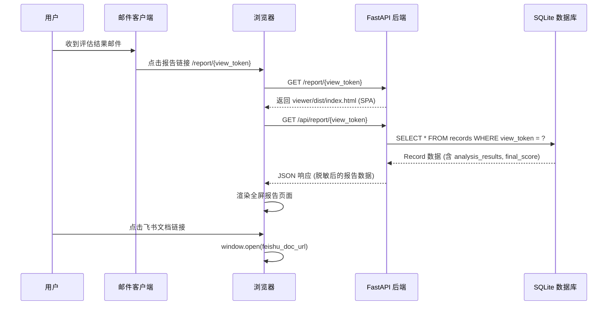
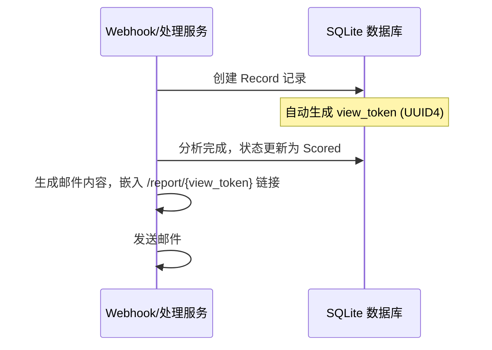

# 设计文档：用户报告查看器 (User Report Viewer)

## 概述

用户报告查看器是 ERA（员工报告分析）系统的一个独立前端页面，用于向用户展示其产品体验报告的 AI 分析结果。该页面通过邮件中嵌入的唯一链接访问，无需登录认证，以全屏只读方式呈现总评分、各维度得分、报告亮点、产品痛点、期望功能以及三位 AI 评委的详细打分情况。

与现有的 Admin 管理后台不同，该页面是一个独立的轻量级 React 应用，部署在 `/viewer` 目录下，由同一个 FastAPI 后端提供服务。页面通过 URL 参数中的 record ID 获取对应的分析数据，并包含飞书文档链接供用户跳转查看原始报告。

为防止 record ID 被枚举攻击，系统将在 Record 模型中新增一个 `view_token` 字段（UUID），作为公开访问的唯一标识符，替代直接暴露数据库自增 ID。

## 架构

```mermaid
graph TD
    subgraph 用户端
        A[用户邮箱] -->|点击链接| B[浏览器]
    end

    subgraph FastAPI 后端
        C["/report/{view_token}" 路由] -->|提供 SPA| D[Viewer 静态文件]
        E["/api/report/{view_token}" API] -->|查询数据| F[(SQLite DB)]
    end

    subgraph Viewer 前端 /viewer
        G[React SPA] -->|fetch| E
        G -->|渲染| H[全屏报告页面]
    end

    B --> C
    B --> G
    H -->|点击链接| I[飞书文档]
```



### 部署架构



## 主要流程

### 用户访问报告流程



### view_token 生成流程



## 组件与接口

### 组件 1：公开报告 API (Backend)

**用途**：提供无需认证的公开 API 端点，根据 view_token 返回报告数据

**接口**：
```typescript
// GET /api/report/{view_token}
interface ReportAPIResponse {
  employee_name: string
  feishu_doc_url: string | null
  final_score: FinalScore
  analysis_results: JudgeResult[]
  created_at: string
}

// 错误响应
interface ErrorResponse {
  detail: string  // "Report not found" | "Report not ready"
}
```

**职责**：
- 根据 view_token 查询 Record
- 仅返回状态为 Scored/Emailing/Done 的记录（分析完成的）
- 过滤敏感字段（不返回 email、raw_text、error_message 等）
- 返回 404 如果 token 无效或记录未就绪

### 组件 2：Viewer 前端 SPA

**用途**：独立的 React 应用，全屏展示报告分析结果

**接口**：
```typescript
// URL 模式: /report/{view_token}
// 前端从 URL path 中提取 view_token，调用 API 获取数据

interface ViewerAppProps {
  // 无 props，从 URL 获取参数
}
```

**职责**：
- 从 URL path 解析 view_token
- 调用 `/api/report/{view_token}` 获取数据
- 全屏渲染报告内容（总分、维度得分、亮点、痛点、期望功能、评委详情）
- 提供飞书文档跳转链接
- 处理加载状态和错误状态

### 组件 3：view_token 字段 (Database)

**用途**：为 Record 模型新增 UUID 字段，用于公开访问标识

**接口**：
```python
# app/models/record.py 新增字段
class Record(Base):
    # ... 现有字段 ...
    view_token: str  # UUID4, unique, indexed, 创建时自动生成
```

## 数据模型

### FinalScore（最终评分）

```typescript
interface FinalScore {
  总分: number          // 0-100
  等级: string          // "S" | "A" | "B" | "C" | "D"
  各维度平均分: {
    体验完整性: DimensionScore
    用户视角还原度: DimensionScore
    分析深度: DimensionScore
    建议价值: DimensionScore
    表达质量: DimensionScore
    态度与投入: DimensionScore
  }
  报告亮点: string[]
  产品痛点总结: string[]
  期望功能总结: string[]
}

interface DimensionScore {
  分数: number
  满分: number
}
```

### JudgeResult（评委结果）

```typescript
interface JudgeResult {
  judge: string         // "Judge 1 (Qwen)" | "Judge 2 (Doubao)" | "Judge 3 (DeepSeek)"
  success: boolean
  总分: number
  等级: string
  各维度评分: {
    体验完整性: DimensionDetail
    用户视角还原度: DimensionDetail
    分析深度: DimensionDetail
    建议价值: DimensionDetail
    表达质量: DimensionDetail
    态度与投入: DimensionDetail
  }
  报告亮点: string[]
  产品痛点总结: string[]
  期望功能总结: string[]
}

interface DimensionDetail {
  分数: number
  满分: number
  评价: string
}
```

### ReportData（前端使用的完整数据）

```typescript
interface ReportData {
  employee_name: string
  feishu_doc_url: string | null
  final_score: FinalScore
  analysis_results: JudgeResult[]
  created_at: string
}
```

**校验规则**：
- `view_token` 必须是有效的 UUID4 格式
- `final_score` 和 `analysis_results` 不能为 null（仅返回已完成分析的记录）
- `analysis_results` 数组长度应为 1-3（至少一位评委成功返回结果）

## 关键函数与形式化规格

### 函数 1：getReportByToken()（后端 API）

```python
# app/routers/report.py
@router.get("/api/report/{view_token}")
async def get_report_by_token(view_token: str) -> ReportAPIResponse:
    ...
```

**前置条件**：
- `view_token` 是非空字符串
- `view_token` 符合 UUID4 格式

**后置条件**：
- 若 token 对应的 Record 存在且状态为 Scored/Emailing/Done：返回 200 + 报告数据
- 若 token 不存在：返回 404 `{"detail": "Report not found"}`
- 若 Record 存在但状态未完成分析：返回 404 `{"detail": "Report not ready"}`
- 返回数据不包含敏感字段（employee_email, raw_text, error_message, email_content）

**循环不变量**：无（单次查询操作）

### 函数 2：fetchReportData()（前端 API 调用）

```typescript
async function fetchReportData(viewToken: string): Promise<ReportData> {
  const response = await fetch(`/api/report/${viewToken}`)
  if (!response.ok) throw new Error(response.statusText)
  return response.json()
}
```

**前置条件**：
- `viewToken` 是从 URL path 中提取的非空字符串
- 网络连接可用

**后置条件**：
- 成功时返回完整的 `ReportData` 对象
- 失败时抛出 Error，包含 HTTP 状态信息
- 不修改任何全局状态

### 函数 3：generateViewToken()（模型层）

```python
import uuid

def generate_view_token() -> str:
    return str(uuid.uuid4())
```

**前置条件**：无

**后置条件**：
- 返回一个有效的 UUID4 字符串
- 每次调用返回不同的值（极高概率）
- 返回值长度为 36 个字符（含连字符）

## 算法伪代码

### 报告数据获取与渲染算法

```pascal
ALGORITHM renderReportPage(url)
INPUT: url 包含 view_token 的页面 URL
OUTPUT: 渲染完成的报告页面

BEGIN
  // Step 1: 解析 URL 获取 token
  viewToken ← extractPathParam(url, "view_token")

  IF viewToken IS NULL OR viewToken IS EMPTY THEN
    renderErrorPage("无效的报告链接")
    RETURN
  END IF

  // Step 2: 显示加载状态
  renderLoadingState()

  // Step 3: 调用 API 获取数据
  TRY
    reportData ← fetchReportData(viewToken)
  CATCH error
    IF error.status = 404 THEN
      renderErrorPage("报告不存在或尚未准备就绪")
    ELSE
      renderErrorPage("加载失败，请稍后重试")
    END IF
    RETURN
  END TRY

  // Step 4: 渲染报告内容
  renderHeader(reportData.employee_name, reportData.feishu_doc_url)
  renderOverallScore(reportData.final_score.总分, reportData.final_score.等级)
  renderDimensionScores(reportData.final_score.各维度平均分)
  renderHighlights(reportData.final_score.报告亮点)
  renderPainPoints(reportData.final_score.产品痛点总结)
  renderFeatureRequests(reportData.final_score.期望功能总结)
  renderJudgeDetails(reportData.analysis_results)

  ASSERT pageIsFullScreen() AND pageIsReadOnly()
END
```

**前置条件**：
- 浏览器已加载 Viewer SPA
- URL 包含有效的 path 参数

**后置条件**：
- 页面显示完整的报告内容，或显示有意义的错误信息
- 页面为全屏只读模式
- 飞书文档链接可点击跳转

### 后端 API 数据过滤算法

```pascal
ALGORITHM filterReportData(record)
INPUT: record 数据库中的完整 Record 对象
OUTPUT: 脱敏后的报告数据

BEGIN
  ASSERT record IS NOT NULL
  ASSERT record.status IN {Scored, Emailing, Done}

  // 仅提取公开展示所需的字段
  reportData ← {
    employee_name: record.employee_name,
    feishu_doc_url: record.feishu_doc_url,
    final_score: record.final_score,
    analysis_results: filterJudgeResults(record.analysis_results),
    created_at: record.created_at
  }

  // 过滤评委结果中的敏感信息（如有）
  FOR each judge IN reportData.analysis_results DO
    // 仅保留成功的评委结果
    IF judge.success = false THEN
      REMOVE judge FROM reportData.analysis_results
    END IF
  END FOR

  ASSERT reportData 不包含 employee_email
  ASSERT reportData 不包含 raw_text
  ASSERT reportData 不包含 error_message

  RETURN reportData
END
```

**前置条件**：
- record 非空且已完成分析
- record.analysis_results 和 record.final_score 非空

**后置条件**：
- 返回的数据不包含任何敏感字段
- 仅包含成功的评委结果
- 数据结构符合 ReportAPIResponse 接口定义

## 示例用法

### 后端 API 端点

```python
# app/routers/report.py
from fastapi import APIRouter, HTTPException
from app.models.record import Record, RecordStatus
from app.utils.database import get_db

router = APIRouter(tags=["report"])

VIEWABLE_STATUSES = {RecordStatus.SCORED, RecordStatus.EMAILING, RecordStatus.DONE}

@router.get("/api/report/{view_token}")
async def get_report(view_token: str):
    with get_db() as db:
        record = db.query(Record).filter(Record.view_token == view_token).first()
        if not record or record.status not in VIEWABLE_STATUSES:
            raise HTTPException(status_code=404, detail="Report not found")

        # 过滤仅成功的评委结果
        judges = [j for j in (record.analysis_results or []) if j.get("success")]

        return {
            "employee_name": record.employee_name,
            "feishu_doc_url": record.feishu_doc_url,
            "final_score": record.final_score,
            "analysis_results": judges,
            "created_at": record.created_at.isoformat() if record.created_at else None,
        }
```

### 前端组件结构

```typescript
// viewer/src/App.tsx
import { useEffect, useState } from 'react'
import { ReportData } from './types'

function App() {
  const [data, setData] = useState<ReportData | null>(null)
  const [error, setError] = useState<string | null>(null)
  const [loading, setLoading] = useState(true)

  useEffect(() => {
    // 从 URL path 提取 view_token: /report/{view_token}
    const pathParts = window.location.pathname.split('/')
    const viewToken = pathParts[pathParts.length - 1]

    if (!viewToken) {
      setError('无效的报告链接')
      setLoading(false)
      return
    }

    fetch(`/api/report/${viewToken}`)
      .then(res => {
        if (!res.ok) throw new Error('报告不存在')
        return res.json()
      })
      .then(setData)
      .catch(err => setError(err.message))
      .finally(() => setLoading(false))
  }, [])

  if (loading) return <LoadingScreen />
  if (error) return <ErrorScreen message={error} />
  if (!data) return null

  return (
    <div className="report-container">
      <ReportHeader name={data.employee_name} docUrl={data.feishu_doc_url} />
      <OverallScore score={data.final_score} />
      <DimensionScores dimensions={data.final_score.各维度平均分} />
      <Highlights items={data.final_score.报告亮点} />
      <PainPoints items={data.final_score.产品痛点总结} />
      <FeatureRequests items={data.final_score.期望功能总结} />
      <JudgeDetails judges={data.analysis_results} />
    </div>
  )
}
```

### 邮件中嵌入链接

```python
# 在邮件服务中生成报告链接
report_url = f"https://your-domain.com/report/{record.view_token}"
# 嵌入邮件模板顶部
email_header = f'<a href="{report_url}">📊 点击查看完整分析报告</a>'
```

## Correctness Properties

*A property is a characteristic or behavior that should hold true across all valid executions of a system-essentially, a formal statement about what the system should do. Properties serve as the bridge between human-readable specifications and machine-verifiable correctness guarantees.*

### Property 1: View Token 格式有效性

*For any* generated view_token, the value SHALL be a valid UUID4 string of exactly 36 characters (including hyphens) that passes UUID format validation.

**Validates: Requirements 1.1, 1.4**

### Property 2: View Token 唯一性

*For any* two distinct Records, their view_token values SHALL be different.

**Validates: Requirement 1.2**

### Property 3: 可查看记录返回完整数据

*For any* Record with a Viewable_Status (Scored, Emailing, Done) and a valid view_token, the Report_API SHALL return HTTP 200 with a response containing employee_name, feishu_doc_url, final_score, analysis_results, and created_at fields.

**Validates: Requirements 2.2, 2.5**

### Property 4: 不可查看场景返回 404

*For any* view_token that either does not exist in the database or corresponds to a Record whose status is not in Viewable_Status, the Report_API SHALL return HTTP 404.

**Validates: Requirements 2.3, 2.4**

### Property 5: API 响应不包含敏感字段

*For any* successful Report_API response, the JSON payload SHALL NOT contain the fields employee_email, raw_text, error_message, or email_content.

**Validates: Requirement 3.1**

### Property 6: 仅返回成功的评委结果

*For any* successful Report_API response, every element in the analysis_results array SHALL have success equal to true.

**Validates: Requirement 3.2**

### Property 7: URL Token 提取正确性

*For any* URL path matching the pattern `/report/{view_token}`, the Report_Viewer SHALL correctly extract the view_token segment from the path.

**Validates: Requirement 4.2**

### Property 8: 有效数据渲染完整性

*For any* valid ReportData object, the Report_Viewer SHALL render all required sections: total score, grade, dimension scores, highlights, pain points, feature requests, and judge details without throwing errors.

**Validates: Requirement 4.3**

### Property 9: 飞书链接条件渲染

*For any* ReportData where feishu_doc_url is non-null, the Report_Viewer SHALL render a clickable link pointing to that URL; when feishu_doc_url is null, no link SHALL be rendered.

**Validates: Requirement 4.5**

### Property 10: 异常数据优雅降级

*For any* ReportData with missing or malformed fields, the Report_Viewer SHALL not crash and SHALL display "暂无数据" for the affected sections.

**Validates: Requirement 5.4**

### Property 11: 邮件包含正确的报告链接

*For any* Record with a view_token, the generated evaluation email SHALL contain a URL in the format `https://{domain}/report/{view_token}` that matches the Record's view_token.

**Validates: Requirement 6.1**

## 错误处理

### 错误场景 1：无效的 view_token

**条件**：URL 中的 view_token 不存在于数据库中
**响应**：API 返回 404，前端显示"报告不存在"错误页面
**恢复**：用户需检查邮件中的链接是否正确

### 错误场景 2：报告尚未就绪

**条件**：Record 存在但状态不在 {Scored, Emailing, Done} 中（如仍在分析中）
**响应**：API 返回 404，前端显示"报告尚未准备就绪，请稍后再试"
**恢复**：用户稍后重新访问链接

### 错误场景 3：网络错误

**条件**：API 请求失败（网络超时、服务器错误等）
**响应**：前端显示"加载失败，请稍后重试"错误页面
**恢复**：用户刷新页面重试

### 错误场景 4：数据格式异常

**条件**：analysis_results 或 final_score 中的 JSON 数据格式不符合预期
**响应**：前端优雅降级，缺失的部分显示"暂无数据"
**恢复**：无需用户操作，系统自动处理

## 测试策略

### 单元测试

- 后端 API：测试 view_token 查询、状态过滤、数据脱敏
- 前端组件：测试各组件在不同数据输入下的渲染结果
- view_token 生成：验证 UUID4 格式和唯一性

### 属性测试

**属性测试库**：Hypothesis (Python) / fast-check (TypeScript)

- 属性 1：任意 view_token 输入，API 响应永远不包含敏感字段
- 属性 2：任意有效 ReportData，前端组件不抛出渲染异常
- 属性 3：生成的 view_token 始终为有效 UUID4 格式

### 集成测试

- 端到端流程：创建 Record → 生成 view_token → 调用 API → 验证响应数据
- 前端集成：模拟 API 响应 → 验证页面完整渲染

## 安全考虑

- **防枚举攻击**：使用 UUID4 作为 view_token（而非自增 ID），暴力猜测的概率极低（2^122 种可能）
- **数据脱敏**：公开 API 仅返回展示所需的字段，不暴露邮箱、原始文本等敏感信息
- **只读访问**：Viewer 页面和 API 仅支持 GET 请求，不提供任何写操作
- **无认证设计**：该页面通过 view_token 的不可猜测性保证安全，无需额外登录

## 依赖

### 后端
- FastAPI（已有）
- SQLAlchemy（已有）
- uuid（Python 标准库）

### 前端（viewer 新项目）
- React 18
- TypeScript
- Vite
- CSS（纯 CSS 或 Tailwind CSS，保持轻量）

### 基础设施
- 同一个 FastAPI 服务器提供 Viewer 静态文件和 API
- 无需额外的数据库或服务
